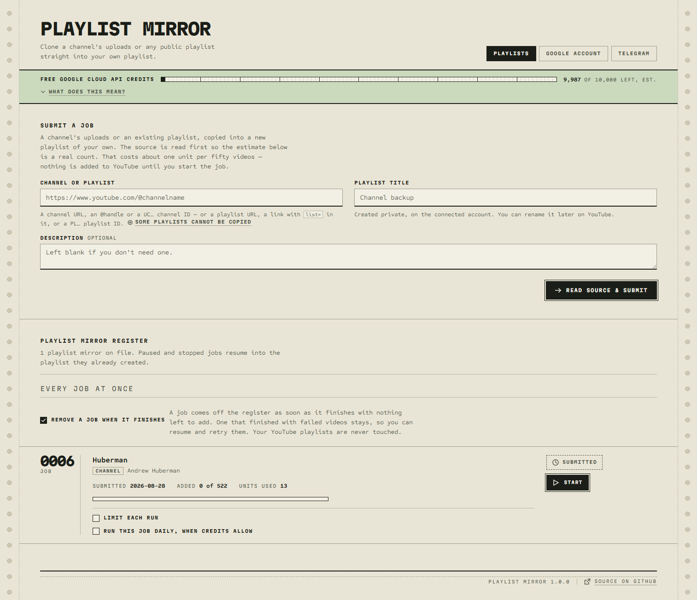

<div align="center">
  
  <h1>Playlist Mirror</h1>
  <p><i>Copy a YouTube channel or playlist into your own private, editable playlist.</i></p>

## [Documentation](https://itobey.github.io/playlist-mirror/)

[](https://artifacthub.io/packages/helm/playlist-mirror/playlist-mirror)
[](https://github.com/itobey/playlist-mirror/actions/workflows/build-image.yml)
[](https://github.com/itobey/playlist-mirror/releases)
[](https://www.gnu.org/licenses/mit.txt)
[](https://github.com/itobey/playlist-mirror/commits/master)
[](https://github.com/itobey/playlist-mirror/commits/master)

</div>

# Overview

YouTube has no built-in way to copy a playlist or turn all the videos from a channel into a
playlist of your own. Playlist Mirror fills that missing feature by using the YouTube Data API
to copy every available video from a channel or playlist into your own private, editable
playlist. You can watch through it and delete videos as you go — something YouTube's channel
pages do not let you do.

<a href="docs/public/images/overview.png" target="_blank" rel="noopener noreferrer">
  
</a>

Using the YouTube Data API does not cost anything. Every Google Cloud project receives a free
daily quota by default, enough to add roughly 200 videos per day. Larger sources may therefore
take several days, so Playlist Mirror estimates the required quota and completion time up
front, pauses cleanly when the daily quota is exhausted, and resumes later without losing
progress or adding duplicates. The app is self-hosted, single-user, and keeps its state locally.

See the [documentation](https://itobey.github.io/playlist-mirror/) for setup, configuration,
quota details, security guidance, and troubleshooting.

# Key Features

- Accepts channel URLs, `@handles`, channel IDs, playlist URLs, and playlist IDs
- Estimates the required API quota and completion time before creating a playlist
- Shows live progress, transfer speed, and remaining time
- Resumes interrupted jobs without duplicating videos
- Optionally continues jobs automatically each day when quota is available
- Re-checks sources for newly uploaded videos
- Sends an optional daily Telegram summary
- Stores all state locally in one persistent data directory

# Prerequisites

- Docker with Docker Compose, or Python 3.12+
- A Google account
- A Google Cloud project with the YouTube Data API v3 enabled
- A Google OAuth client for the account that will manage the destination playlists

# Quick Start

```bash
docker compose up -d
```

Open <http://localhost:8000> and follow the in-app setup. Playlist Mirror guides you through
uploading the OAuth client file and connecting your Google account. Persistent state is kept
in `./data`; back up that directory to preserve your sign-in, settings, and jobs.

For the complete Google Cloud and OAuth setup, see
[Installation & setup](https://itobey.github.io/playlist-mirror/introduction/getting-started).

# Technology Stack

- Python 3.12, FastAPI, Uvicorn, and Jinja
- SQLite
- YouTube Data API v3 and Google OAuth 2.0
- Docker and Docker Compose
- VitePress documentation

# Privacy

Your Google credentials and playlist data are used only by your installation and the YouTube
API; they are not sent to the project maintainer. Playlist Mirror sends a small anonymous
telemetry payload containing counts, flags, and runtime information; it does not include
account, channel, playlist, or video identifiers. See
[Privacy and telemetry](https://itobey.github.io/playlist-mirror/details/telemetry) for the
complete payload and opt-out options.

Playlist Mirror has no built-in login. Keep non-local installations on a trusted network,
behind a VPN, or behind an authenticated reverse proxy.

# Limitations

- One YouTube account per installation
- Sources are copied in full; filtering by date or keyword is not supported
- Watch Later and Liked Videos cannot be read through the YouTube API
- Continuous syncing is not supported; updates are found by re-checking a source or by a
  daily run

# Contributing

Contributions are welcome. Please open an issue or submit a pull request once the repository
is public.
